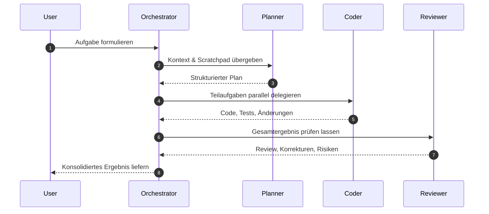

Moderne KI‑Werkzeuge versprechen Unterstützung in allen Bereichen der Softwareentwicklung. Doch je mehr Aufgaben wir an KI‑Modelle delegieren, desto deutlicher wird ein Problem: **Komplexität entsteht nicht nur im Code, sondern auch in der Koordination der Werkzeuge selbst.**

Die Lösung ist kein größeres Modell, sondern eine **bessere Organisation**.  
Im Zentrum steht ein Orchestrator, ein Agent, der nicht selbst arbeitet, sondern **führt**.

## Warum ein Orchestrator unverzichtbar ist

Ein einzelner KI‑Agent kann viel, aber nicht alles gleichzeitig.   Er verliert Fokus, wenn er zu viel Kontext tragen muss, und er wird langsam, wenn er zu viele Aufgaben gleichzeitig lösen soll.

Ein Orchestrator löst dieses Problem, indem er:

- Aufgaben **zerlegt**
- Subagents **gezielt auswählt**
- Modelle **situationsgerecht kombiniert**
- Ergebnisse **zusammenführt**
- Schleifen **kontrolliert** und **korrigiert**

Damit entsteht ein System, das nicht nur leistungsfähig, sondern **beherrschbar** bleibt.

## Das Grundmuster: Ein Orchestrator, viele Subagents

Ein praxistauglicher Orchestrator folgt einem klaren Ablauf. 
Das folgende Muster hat sich in realen Entwicklungsprozessen bewährt:

### **1. Kontext sammeln (schnelles Modell)**  
Ein leichter Subagent durchsucht Dateien, liest Logs, extrahiert Hinweise und schreibt alles in ein **Scratchpad**. 
Er liefert keine Lösung, sondern **Material**.

### **2. Planung (größeres Modell)**  
Ein Planungsagent analysiert das Scratchpad und erstellt einen **präzisen, schrittweisen Plan**. 
Dieser Plan ist das Herzstück: 
Er muss so klar sein, dass mehrere Subagents unabhängig arbeiten können.

### **3. Parallele Umsetzung (mehrere schnelle Modelle)**  
Mehrere Implementierungsagenten übernehmen einzelne Schritte des Plans:

- Code schreiben  
- Tests generieren  
- Refactorings durchführen  
- Dokumentation ergänzen  

Da der Plan eindeutig ist, können sie **parallel** arbeiten, ohne sich gegenseitig zu behindern.

### **4. Code‑Review (teures Modell)**  
Ein stärkeres Modell prüft:

- Konsistenz  
- Stil  
- Abweichungen vom Plan  
- Risiken und Nebenwirkungen  

Es liefert Korrekturen, die der Orchestrator erneut verteilt.

### **5. Schleifen steuern**  
Der Orchestrator erkennt:

- Konflikte  
- fehlende Informationen  
- unklare Ergebnisse  

Er startet Subagents neu, passt den Plan an oder fordert zusätzliche Informationen an.

## Context‑Rot: Das schleichende Gift großer Kontexte

Je länger ein einzelner Agent arbeitet, desto stärker wächst sein Kontext und desto unpräziser wird er. 
Dieses Phänomen nennt man **Context‑Rot**:

- irrelevante Details sammeln sich an  
- frühere Annahmen bleiben unreflektiert im Kontext  
- Fehler verstärken sich über mehrere Iterationen  
- das Modell verliert Klarheit und Fokus  

Context‑Rot ist kein Randproblem, sondern eine strukturelle Schwäche monolithischer Agenten. 
Orchestrierte Systeme vermeiden es, indem sie **Kontexte isolieren**, **Scratchpads begrenzen** und **Aufgaben klar trennen**. 
Jeder Subagent arbeitet frisch, ohne Altlasten – und liefert dadurch präzisere Ergebnisse.

## Sequenzdiagramm: Wie ein Orchestrator Subagents steuert

Das folgende Sequenzdiagramm zeigt einen typischen Ablauf in einem agentenbasierten KI‑Workflow. 
Es bildet die Interaktion zwischen Nutzer, Orchestrator und spezialisierten Subagents ab.

## Warum dieses Muster funktioniert

Der Erfolg liegt in der **Trennung der Verantwortlichkeiten**:

| Aufgabe | Agententyp | Vorteil |
|--------|------------|---------|
| Kontext sammeln | kleines Modell | schnell, billig, breit |
| Planung | großes Modell | tief, strukturiert, präzise |
| Umsetzung | mehrere kleine Modelle | parallel, effizient |
| Review | großes Modell | Qualitätssicherung |

 
So entsteht ein System, das **Skalierbarkeit** und **Qualität** vereint.

## Praktische Einsatzfelder

Dieses Muster eignet sich für:

- Feature‑Planung  
- Refactorings  
- Code‑Reviews  
- Architekturentscheidungen  
- Dokumentationsprozesse  
- Fehlersuche  
- Explorative Analysen  

Überall dort, wo Aufgaben komplex, mehrstufig oder unübersichtlich sind, bringt ein Orchestrator Struktur.

## Fazit

Die Zukunft der KI‑gestützten Entwicklung gehört nicht dem größten Modell, sondern der **besten Organisation**. Ein Orchestrator schafft Ordnung, wo sonst Chaos droht.  
Er macht KI‑Systeme nicht nur leistungsfähiger, sondern **verlässlicher**.

## Referenzen

- [Subagents: Parallel Execution and Context Isolation](https://www.youtube.com/watch?v=GMAoTeD9siU&list=TLGGSDRZ4Em495MxMzAyMjAyNg)
- [Agent Orchestration](https://www.youtube.com/watch?v=-BhfcPseWFQ)